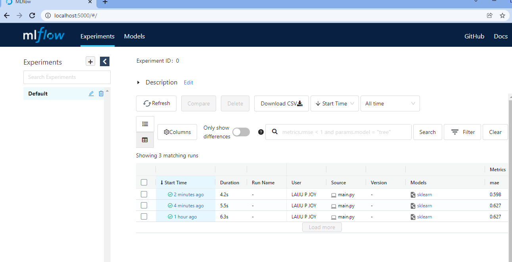

# MLflow Tracking on local host

MLflow Tracking is organized around the concept of runs, which are executions of some piece of data science code. 
Each run records the following information:

Code Version
Start & End Time
Source
Parameters
Metrics
Artifacts

We can run MLflow on local machine, where both the backend and artifact store share a directory 
on the local filesystem—./mlruns—as shown in the diagram. 
The MLflow client directly interfaces with an instance of a FileStore and LocalArtifactRepository.


In this simple scenario, the MLflow client uses the following interfaces to record MLflow entities and artifacts:

An instance of a LocalArtifactRepository (to store artifacts)

An instance of a FileStore (to save MLflow entities)


# Steps To Be Followed

## Step 1. Run machine learning code on local machine

```
python main.py
```
```
mlflow ui
```


## Step 2. Connect to the MLFlow UI 

Connect to the MLFlow UI @ http://127.0.0.1:5000.
We can see that experiments are getting logged, and analysis the models perfomance.
Based on requirements, choose a required model and promoted to deployment mode.




